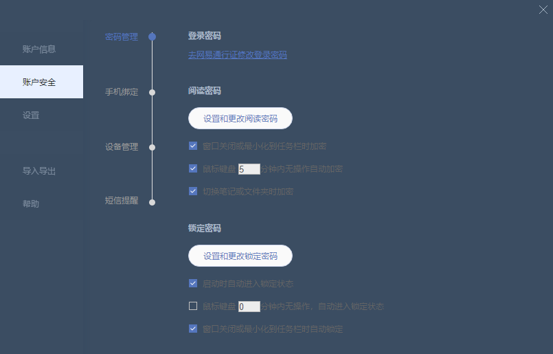
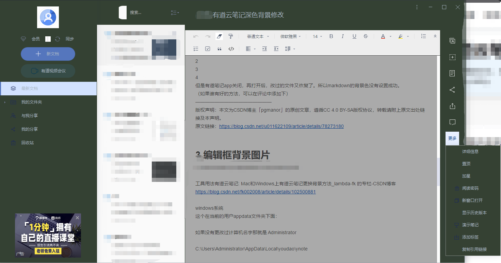

# youdao-note-theme
有道云笔记的皮肤

# 版本修订
- 20210515 目前主要是针对没有暗夜皮肤做的修改

# 目录说明
- local-data-path:一般windows指安装C盘LocalData目录下
```C:\Users\Administrator\AppData\Local\youdao\ynote```
- setup-path:一般windows指安装目录下
```X:\xxx\Youdao\YunNote\YoudaoNote\theme\default```

## 使用方法
分别替换对应目录的文件即可，注意备份原版文件。

# 颜色说明
- 白色替换： 255,255,255   -> 52,65,51  #344133
- 黑色替换： 37,57,51 ->  169,183,198  #a9b7c6

TIPS： 以上颜色来自于IDEA的暗夜模式

# 详细设置
## 用户详情菜单设置
修改安装文件目录下的两个样式
```X:\XX\Youdao\YoudaoNote\res\htmls\css\htmldialogbase.css```
```X:\XXX\Youdao\YoudaoNote\res\htmls\editorList.html```

效果图
<br>


## 主背景色和字体色
<br>

- 一些主要的按钮我做了浅色图片替换

### skin.xml中的主要模块：
<br>
``X:\XXX\Youdao\YoudaoNote\theme\default\skin.xml``
<br>

- RightPanelToolbar  ： 右边的分享、插入等菜单
- notebooktree ： 左边文件夹菜单
- nbtreeSelBk:普通模式左边文件夹菜单背景色
- nbtreeSelBkSimple：缩小模式左边文件夹菜单背景色
- FormBkPopup：弹出框，比如点击头像的弹出框。

### 参考资料
有道云笔记修改护眼绿背景色-v6.8_沐雨云楼-CSDN博客  https://blog.csdn.net/u011622109/article/details/78273180

### 效果图


## 修改编辑框背景图片
这个比较简单，完全按照参考资料找到对应目录替换图片文件。
```windows系统
  这个在当前的用户appdata文件夹下面：
  如果没有更改过计算机名字那就是 Administrator
  C:\Users\Administrator\AppData\Local\youdao\ynote
  其中有一个很重要的配置文件: profile.ini
  搜索这个文件中的 NoteBgVersion  看看是什么配置
  NoteBgVersion=0
  后面如果为 0  表示的是使用的是 
  bgImage-0 这个文件夹了
  因此可以灵活使用这个值的
  例如  NoteBgVersion=10
  那么就做一个 bgImage-10 的文件夹。
  bgImage-XX 文件夹
  这个文件夹里面就是存放我们得背景图片的
  里面以  c-开头的图片就是我们普通客户用的
  以v-开头的图片就是会员使用的
  因此 自己可以自由发挥了，Windows中比较简单
  直接 往这个文件夹里面按照命名规则放图片即可
```

```
mac系统
mac系统更换方法和windows差不多，只是这个目录不好找
而且mac上没有  windows那么自由更换
从  Finder 里面  按住  shift+command+g  弹出对话框
然后键入
~/Library/Containers/com.youdao.note.YoudaoNoteMac/Data/Library/Application Support/com.youdao.note.YoudaoNoteMac/bgImage
```

不过这个方法的缺点也很明显，旧笔记的背景需要自己设置。

### 参考资料
版权声明：本文为CSDN博主「lambda-fk」的原创文章，遵循CC 4.0 BY-SA版权协议，转载请附上原文出处链接及本声明。
原文链接：https://blog.csdn.net/fk002008/article/details/102500881

## 编辑框背景色及样式修改
主要目录
<br>
```C:\Users\XXX\AppData\Local\youdao\ynote\6.10.1.0\bulbeditor\```

### bulb.html 修改引用的css文件为固定值，这样就不会自动更新了
<br>

```
<!DOCTYPE HTML>
<html manifest="../manifest.appcache?909650a93043da5862c7">
    <head>
        <meta http-equiv="content-type" content="text/html; charset=utf-8">
        <title>Bulb editor for pc</title>
        <script type="text/javascript">
            window.DEBUG = false;
            window.YNE_PLATFORM = 'pc';
        </script>
    <link href="./bulb.min.css" rel="stylesheet"></head>
    <body style="overflow:hidden;">
    <script src="./vendor.min.js?909650a93043da5862c7"></script><script src="./bulb.min.js?909650a93043da5862c7"></script></body>
</html>
```

### 修改 bulb.min.css

我顺带修改了菜单栏的背景样式

- .note-view-frame  的属性就是背景色

### 效果图


# 不足之处
- 不是所有图片都有亮图，没有花时间全弄完
- 笔记列表不知道在哪里修改背景，还是死白
- 搜索框、头像框附件还有死白


